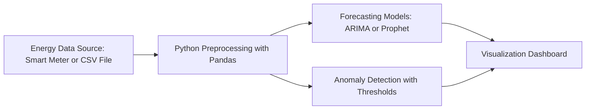
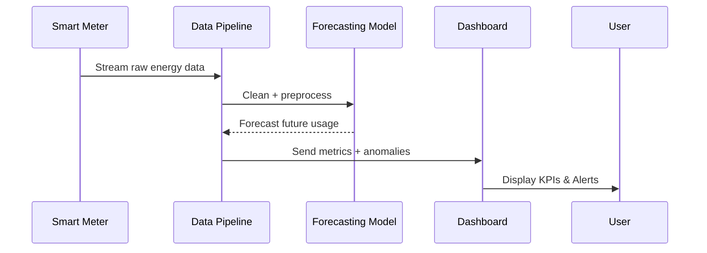
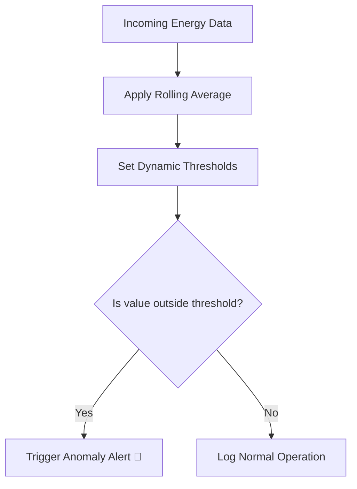

# ⚡ Smart Energy Monitoring with Predictive Analytics  

A data-driven project that combines **real-time monitoring** and **machine learning forecasting** to optimize energy usage in industrial systems.  

---

## 📌 Features  
- 📊 Real-time monitoring of energy consumption  
- 🔮 Predictive analytics with ARIMA / Prophet  
- 🚨 Anomaly detection for unexpected spikes/drops  
- 📈 Dashboard with live vs forecasted energy usage  

---

## 📊 System Architecture  



---

## 🔎 Data Flow  



---

## 🚨 Anomaly Detection Workflow  



---

## 🖥️ Dashboard Example  

  

KPIs displayed:  
- Current Load (kWh)  
- Forecasted Load (next 24h)  
- Anomaly Alerts  
- Daily Peak vs Average Usage  

---

## 🔧 Tech Stack  
- **Python** (Pandas, NumPy, scikit-learn, statsmodels, Prophet)  
- **Matplotlib / Plotly** for visualization  
- **Streamlit / Dash** for dashboard interface  
- **Git** for version control  

---

## 🚀 Getting Started  

1. Clone the repo:  
   ```bash
   git clone https://github.com/yourusername/smart-energy-monitoring.git
   cd smart-energy-monitoring
   ```
2. Install dependencies:  
   ```bash
   pip install -r requirements.txt
   ```
3. Run the dashboard:  
   ```bash
   streamlit run app.py
   ```

---

## 📊 Example Results  

- Forecast horizon: 24 hours  
- Accuracy (MAPE): ~10%  
- Alerts triggered: 3 anomalies in test dataset  

---

## 📂 Project Structure  

```
smart-energy-monitoring/
│── data/               # Sample datasets
│── notebooks/          # Jupyter notebooks (exploration, forecasting)
│── src/                # Python modules
│   ├── preprocessing.py
│   ├── forecasting.py
│   ├── anomaly.py
│   └── dashboard.py
│── images/             # Architecture + Dashboard screenshots
│── app.py              # Streamlit app
│── requirements.txt
│── README.md
```

---

## 🌱 Impact  
This project shows how **predictive analytics in energy management** can reduce costs, avoid failures, and contribute to sustainable industry practices.  
